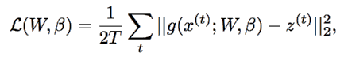
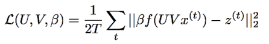

# journal-club
## 04.11.2017

### Do Deep Nets Really Need to be Deep?
Author: Lei Jimmy Ba, Rich Caruana

Link: https://arxiv.org/pdf/1312.6184.pdf

Motivation: exploring the source of improvement of DNN model, is it really because of the deeper topology? 

Goal: showing that shallow net *with the same number of parameters* can performs as good as deep net.

Approach: instead of learning a shallow model directly from the data, the author trains a complex model first and uses it as a "teacher" to teach shallow "student".

Algorithm: student learns from the logit output of the teacher (more information compare to softmax output), and then minimizing the square loss (take it as a regression problem). Namely,

where  is the model prediction. 

To speed up, the student decompose $W$ with two low rank matrix, namely.

Evaluation: train different networks on speech recognition data and use the best model (ensemble of DNN) as teacher to train shallow model. 
