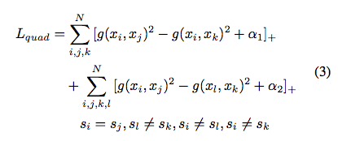

# journal-club

## 06.11.2017
### Beyond triplet loss: a deep quadruplet network for person re-identification
**Author:** Weihua Chen, Xiaotang Chen, etc.

**Link:** https://arxiv.org/pdf/1704.01719.pdf

**Motivation:** Quadruplet loss produces larger inter-class variation and smaller intra-class variation, tends to generalize better on the test set. 

**Approach:** optimize two aspects simultaneously, 1) the distance of pairs from same class (they call probe) should be smaller than from other class. If anchor is B1, relevant to B3, then B1B3 (intra-class) < B1A3 (inter-class). 2) the distance of negative pairs should be greater than any other pairs from the same class, i.e. B1A3 > C1C2, or equivalently B1B3 (intra-class) < C1A3 (inter-class). where C1A3 are all irrelevant to B1B3

They propose a margin-based sampling approach to sample difficult negative examples for training. 

**Algorithm:**
Triplet loss with l2-norm metric and hinge loss:, a more general is to learn the metric, e.g. the distance function g in , they proposed 

**Evaluation:** 
Top-1 classification accuracy (rank-1) on CUHK01, CUHK03, VIPeR

## 05.11.2017
### Learning Deep Structured Semantic Models for Web Search using Clickthrough Data
**Author:** Po-Sen Huang, Xiaodong He, etc.

**Link:** https://www.microsoft.com/en-us/research/wp-content/uploads/2016/02/DSSM_cikm13_talk_v4.pdf

**Motivation:** Keyword-based matching often fails due to the lack of semantic level interpretation. They proposed a DL model to put query and document into a common low-dim space in a supervised way (i.e. using clickthorugh data).

**Approach:** Use DNN to map high-dimensional sparse text features into low-dim dense features in a semantic space. The relevance score between query and doc is measured by cosine. For word, they proposed a "word hashing" method, breaking down the word into character-level ngrams. 

They simply use (siamese) DNN for both doc and query, no fancy architecture in this version. 

**Algorithm:** minimize the following function:
, where
, and 

**Evaluation:** Test how model can generalize from the popular URL-clicks to tail or new URLs. Baselines: TF-IDF, BM25, WTM, LSA, PLSA. Bilingual topic model with posterior regularization, discriminative projection model.

 

## 04.11.2017

### Do Deep Nets Really Need to be Deep?
**Author:** Lei Jimmy Ba, Rich Caruana

**Link:** https://arxiv.org/pdf/1312.6184.pdf

**Motivation:** exploring the source of improvement of DNN model, is it really because of the deeper topology? 

**Goal:** showing that shallow net *with the same number of parameters* can performs as good as deep net.

**Approach:** instead of learning a shallow model directly from the data, the author trains a complex model first and uses it as a "teacher" to teach shallow "student".

**Algorithm:** student learns from the logit output of the teacher (more information compare to softmax output), and then minimizing the square loss (take it as a regression problem). Namely,

where  is the model prediction. 

To speed up, the student decompose $W$ with two low rank matrix, namely.

**Evaluation:** train different networks on speech recognition data and use the best model (ensemble of DNN) as teacher to train shallow model. 
